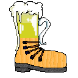
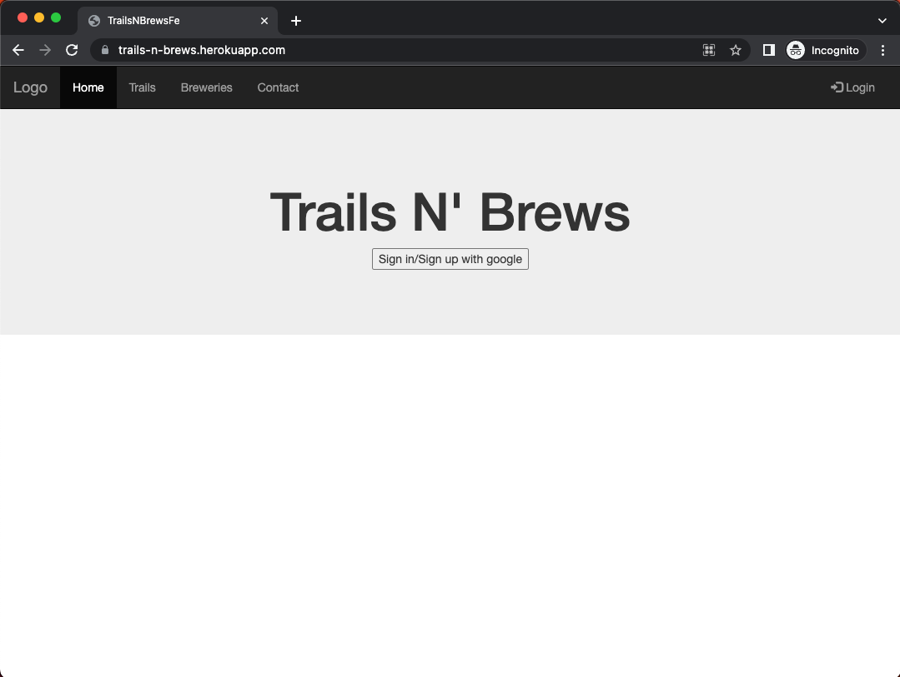
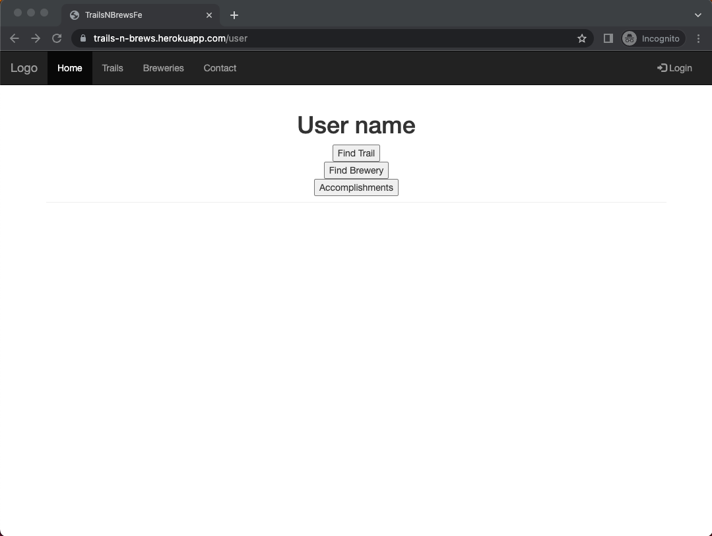
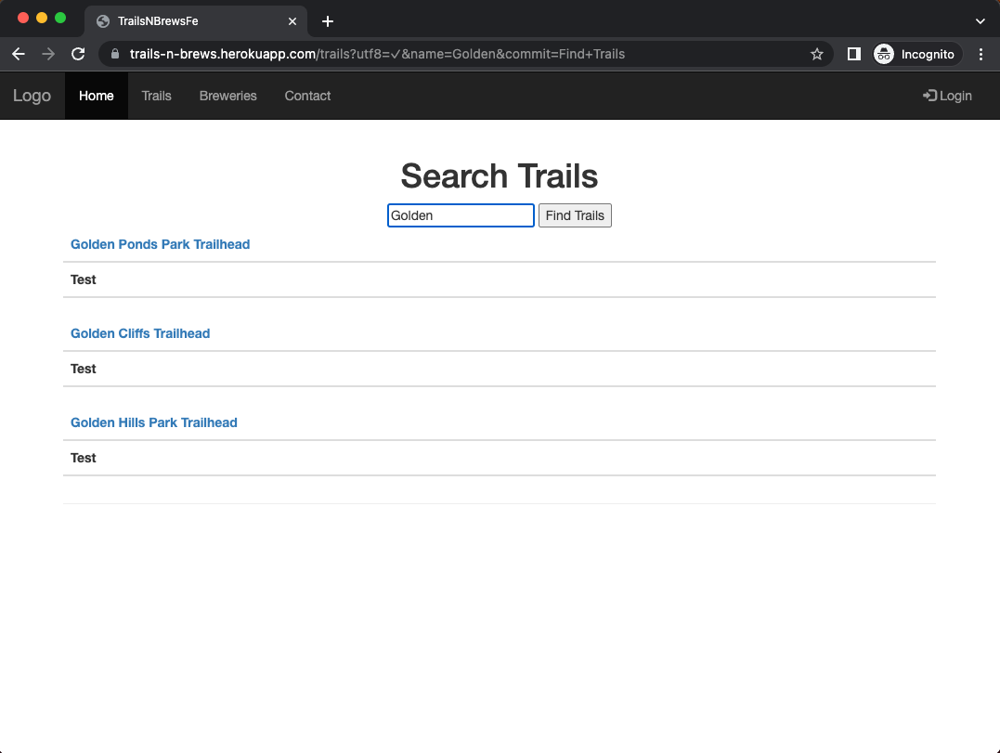
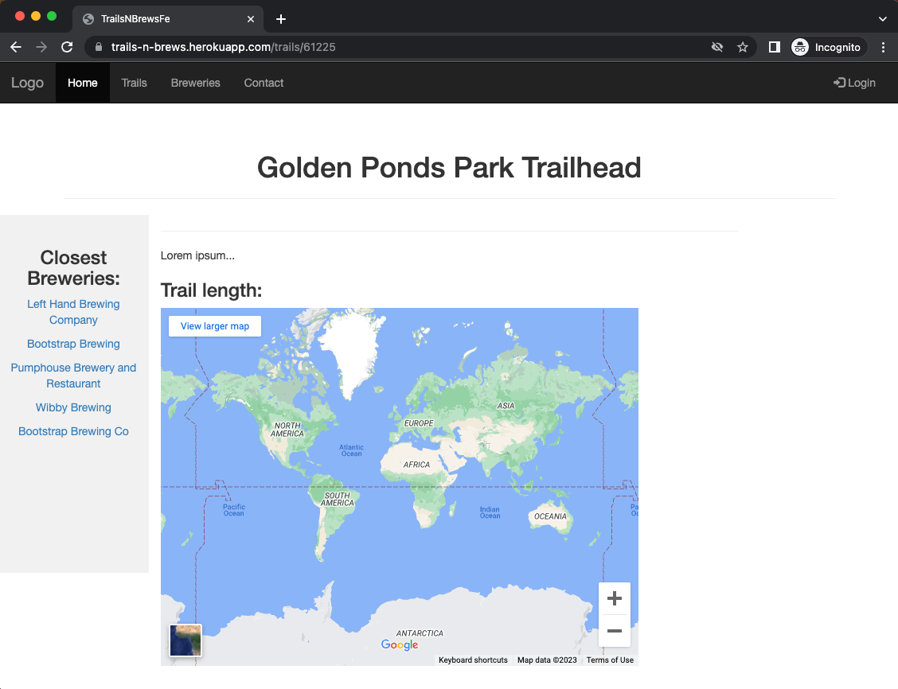
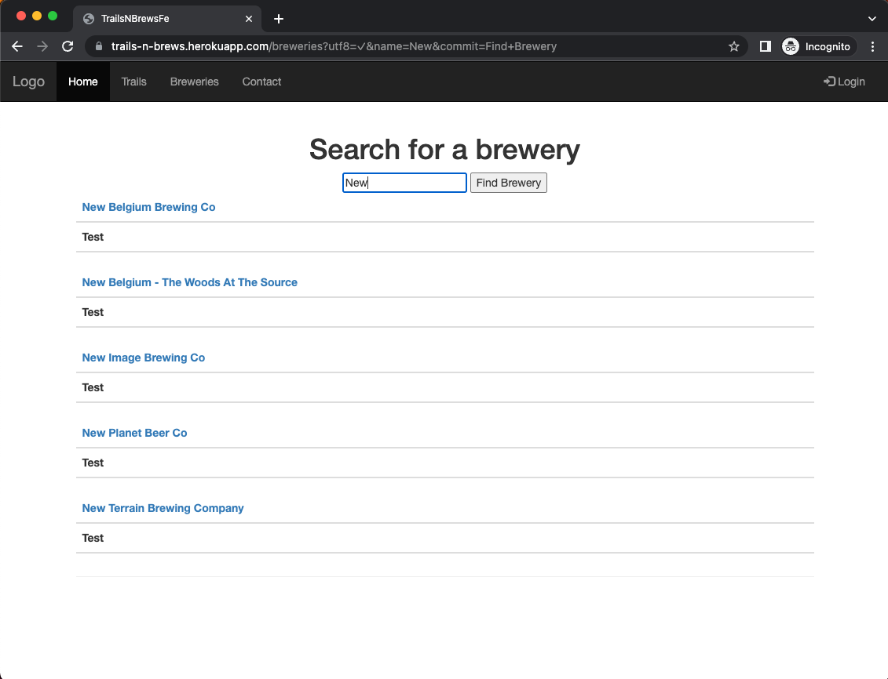
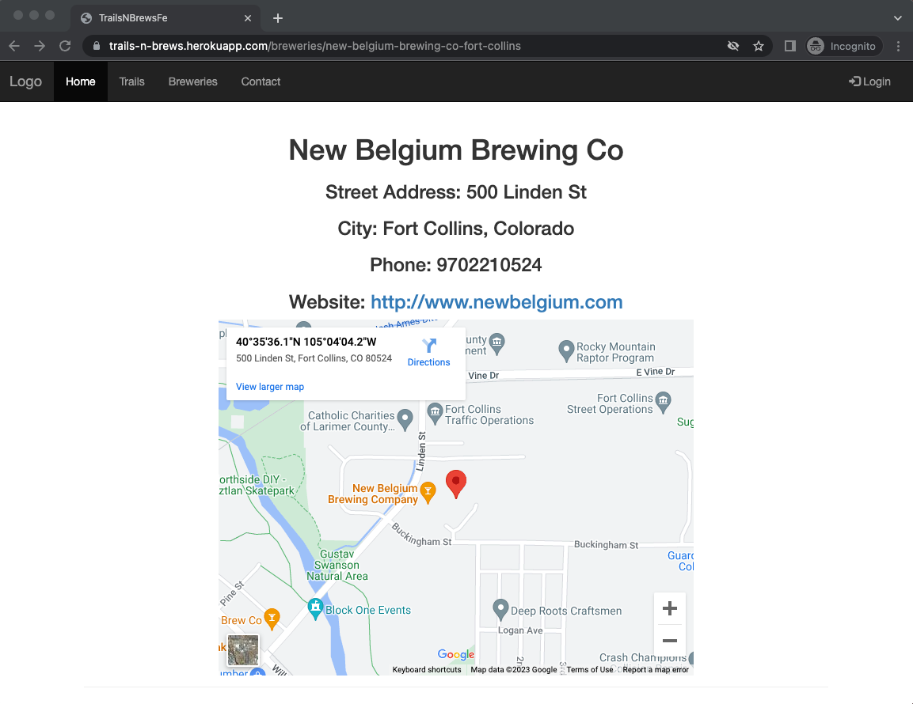

# Trails-N-Brews_FE

<a name="readme-top"></a>

<!-- PROJECT SHIELDS -->
[![Activity][commit-activity-shield]][commit-activity-url]
[![Commit][last-commit-shield]][last-commit-url]
[![Contributors][contributors-shield]][contributors-url]
[![Forks][forks-shield]][forks-url]
[![Stargazers][stars-shield]][stars-url]
[![Issues][issues-shield]][issues-url]
[![Code-Size][code-size-shield]][code-size-url]<br>
[![Watchers][watchers-shield]][watchers-url]

<!-- PROJECT LOGO -->
<br />
<div align="center">
  <a href="https://github.com/TrailsNBrews/Trails-N-Brews_FE">
    
  </a>
  <h3 align="center">Trails N Brews, FE</h3>

  <p align="center">
    A guide to lead hikers to "watering holes"
    <br />
    <a href="https://github.com/TrailsNBrews/Trails-N-Brews_FE/"><strong>Explore the docs »</strong></a>
    <br />
    <br />
    <a href="https://github.com/TrailsNBrews/Trails-N-Brews_FE/">View Demo</a>
    ·
    <a href="https://github.com/TrailsNBrews/Trails-N-Brews_FE/issues">Report Bug</a>
    ·
    <a href="https://github.com/TrailsNBrews/Trails-N-Brews_FE/issues">Request Feature</a>
  </p>
</div>

<!-- TABLE OF CONTENTS -->
<details>
  <summary>Table of Contents</summary>
  <ul list-style-position="inside">
    <li>
      <a href="#about-the-project">About The Project</a>
      <ul>
        <li><a href="#learning-goals">Learning Goals</a></li>
        <li><a href="#built-with">Built With</a></li>
        <li><a href="#roadmap">Roadmap</a></li>
      </ul>
    </li>
    <li>
      <a href="#getting-started">Getting Started</a>
      <ul>
        <li><a href="#prerequisites">Prerequisites</a></li>
        <li><a href="#installation">Installation</a></li>
      </ul>
    </li>
    <li>
      <a href="#usage">Usage</a>
      <ul>
        <li><a href="#endpoints">Endpoints</a></li>
      </ul>
    </li>
    <li><a href="#contributing">Contributing</a></li>
    <li><a href="#developers">Developers</a></li>
    <li><a href="#project-managers-instructors">Project Managers-Instructors</a></li>
  </ol>
</details>

<!-- ABOUT THE PROJECT -->
## About The Project

<!-- [![Product Name Screen Shot][product-screenshot]](https://example.com) -->

Trails N' Brews (TnB) is a web app seeking to answer one of life's greatest needs for the Colorado hiker. Whether it be a 1 mile trail along the front range or an expedition to the summit of one this great state's many 14ers all hikers want to know where the nearest brewery is to celebrate and wind down from their achievement. TnB is designed with service oriented architecture.

This repository holds the front end code for TnB, the backend repo is located [here](https://github.com/TrailsNBrews/trails_n_brews_BE)


<p align="right">(<a href="#readme-top">back to top</a>)</p>

### Built With

  [![Ruby]][Ruby-url] [![Rails]][Rails-url] [![Bootstrap]][Bootstrap-url]
  [![Heroku]][Heroku-url] [![Postgres]][Heroku-url] [![Postman]][Postman-url]

<p align="right">(<a href="#readme-top">back to top</a>)</p>

### Learning Goals

* Project management and organization
* Agile workflows
* Improve individual and group communication skills
* Microservice integration and implementation
* Service integration and implementation
* OAuth utilization
* Efficient API consumption
<!-- Others can be added as needed -->

<p align="right">(<a href="#readme-top">back to top</a>)</p>

<!-- GETTING STARTED -->
## Getting Started

### Prerequisites

* Ruby 2.7.4
* Rails 5.2.8

### Installation

_Below are instructions for forking and cloning this repo_

<!-- add clone gif http://www.giphy.com/gifs/MGGuPEeUJu6qVeIMv5 -->
1. Clone the repo
   ```sh
   git clone git@github.com:TrailsNBrews/Trails-N-Brews_FE.git
   ```
2. Install gems
   ```sh
   bundle install
   ```
3. Setup the database
   ```js
   rails db:{create,migrate}
   ```
4. Run RSpec tests
    ```sh
    bundle exec rspec
    ```

<p align="right">(<a href="#readme-top">back to top</a>)</p>


## Usage

- Visit https://trails-n-brews.herokuapp.com/ to arrive at the landing page:
  - Click the 'Sign in/Sign up with Google' button (a Google account is required to use this app)
  - Log in to a Google account
  - If login is successful, the page will redirect to a user dashboard
  

- Dashboard:
  - From the user dashboard, a user can find a trail, find a brewery, or list their accomplishments
  

- Find a trail:
  - Click the `Find Trail` button, and enter a search for a trail 
  - The top three trails are displayed
  

- View a trail:
  - Click on the desired trail
  - A description of the trail will display along with its difficulty rating and location
  - A location of the trailhead is provided by utilizing Google Maps API
  

- Find a brewery:
  - Click the `Find Brewery` button, and enter a search for a brewery 
  - The top five breweries are displayed
  

- View a brewery:
  - Click on the desired brewery
  - The brewery's pertinent information will display
  - A location of the brewery is provided by utilizing Google Maps API
  

<p align="right">(<a href="#readme-top">back to top</a>)</p>

### Endpoints

- Root directory: 'https://trails-n-brews.herokuapp.com'

<p align="right">(<a href="#readme-top">back to top</a>)</p>

## Developers

<div align="center">
  
  <p align="center">
    Brandon Gray<br>
    <a href="https://github.com/bGray88">Github: bGray88</a>
  </p>
</div>
<div align="center">
  
  <p align="center">
    Christian McCabe<br>
    <a href="https://github.com/cemccabe">Github: cemccabe</a>
  </p>
</div>
<div align="center">
  
  <p align="center">
    Kyle Ledin<br>
    <a href="https://github.com/Kledin85">Github: Kledin85</a>
  </p>
</div>
<div align="center">
  
  <p align="center">
    Leo Banos Garcia<br>
    <a href="https://github.com/banosl">Github: banosl</a>
  </p>
</div>
<div align="center">
  
  <p align="center">
    Max MacGillivray<br>
    <a href="https://github.com/MoxieMax">Github: MoxieMax</a>
  </p>
</div>
<div align="center">
  
  <p align="center">
    Sergio Azcona<br>
    <a href="https://github.com/Sergio-Azcona">Github: Sergio-Azcona</a>
  </p>
</div>

Project Links: <br> 
[Organization Link](https://github.com/orgs/TrailsNBrews/repositories) <br>
[Backend Link](https://github.com/TrailsNbrews/trails_n_brews_BE) <br>
[Frontend Link](https://github.com/TrailsNBrews/Trails-N-Brews_FE)

## Project Managers/Instructors

1. Meg Stang
2. Mike Dao

<p align="right">(<a href="#readme-top">back to top</a>)</p>


<!-- MARKDOWN LINKS & IMAGES -->
<!-- https://www.markdownguide.org/basic-syntax/#reference-style-links -->

[commit-activity-shield]: https://img.shields.io/github/commit-activity/m/TrailsNBrews/trails_n_brews_BE?style=for-the-badge
[commit-activity-url]: https://github.com/TrailsNBrews/Trails-N-Brews_FE/commits/main
[last-commit-shield]: https://img.shields.io/github/last-commit/TrailsNBrews/trails_n_brews_BE?style=for-the-badge
[last-commit-url]: https://github.com/TrailsNBrews/Trails-N-Brews_FE/commits/main
[contributors-shield]: https://img.shields.io/github/contributors/TrailsNBrews/trails_n_brews_BE.svg?style=for-the-badge
[contributors-url]: https://github.com/TrailsNBrews/Trails-N-Brews_FE/graphs/contributors
[forks-shield]: https://img.shields.io/github/forks/TrailsNBrews/trails_n_brews_BE.svg?style=for-the-badge
[forks-url]: https://github.com/TrailsNBrews/Trails-N-Brews_FE/network/members
[stars-shield]: https://img.shields.io/github/stars/TrailsNBrews/trails_n_brews_BE.svg?style=for-the-badge
[stars-url]: https://github.com/TrailsNBrews/Trails-N-Brews_FE/stargazers
[issues-shield]: https://img.shields.io/github/issues/TrailsNBrews/trails_n_brews_BE.svg?style=for-the-badge
[issues-url]: https://github.com/TrailsNBrews/Trails-N-Brews_FE/issues
[code-size-shield]: https://img.shields.io/github/languages/code-size/TrailsNBrews/trails_n_brews_BE?style=for-the-badge
[code-size-url]: https://github.com/TrailsNBrews/Trails-N-Brews_FE/wiki
[watchers-shield]: https://img.shields.io/github/watchers/TrailsNBrews/trails_n_brews_BE?style=social
[watchers-url]: https://github.com/TrailsNBrews/Trails-N-Brews_FE/network/members
[license-shield]: https://img.shields.io/github/license/TrailsNBrews/trails_n_brews_BE.svg?style=for-the-badge
[license-url]: https://github.com/TrailsNBrews/Trails-N-Brews_FE/blob/master/LICENSE.txt
[linkedin-shield]: https://img.shields.io/badge/-LinkedIn-black.svg?style=for-the-badge&logo=linkedin&colorB=555
[linkedin-url]: https://linkedin.com/in/linkedin_username
[product-screenshot]: images/screenshot.png

[Bootstrap]: https://img.shields.io/badge/Bootstrap-563D7C?style=flat&logo=bootstrap&logoColor=white
[Bootstrap-url]: https://getbootstrap.com

[Ruby]: https://img.shields.io/badge/-Ruby-CC342D?style=flat&logo=ruby&logoColor=white
[Ruby-url]: https://www.ruby-lang.org/en/

[Rails]: https://img.shields.io/badge/-Ruby%20on%20Rails-CC0000?style=flat&logo=rubyonrails&logoColor=white
[Rails-url]: https://rubyonrails.org

[Heroku]: https://img.shields.io/badge/-Heroku-430098?style=flat&logo=heroku&logoColor=white
[Heroku-url]: https://www.heroku.com/

[Postgres]: https://img.shields.io/badge/-Postgres-4169E1?style=flat&logo=postgresql&logoColor=white
[Postgres-url]: https://www.postgresql.org/

[Postman]: https://img.shields.io/badge/-Postman-FF6C37?style=flat&logo=postman&logoColor=white
[Postman-url]: https://www.postman.com/
